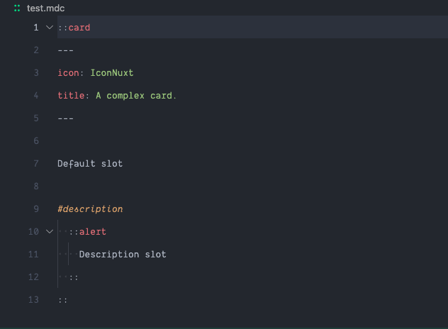

# MDC syntax highlight for Visual Studio Code

[![MDC Extension for VS Code][extension-version-src]][extension-href]
[![MDC Extension for VS Code][extension-downloads-src]][extension-href]
[![MDC Extension for VS Code][extension-installs-src]][extension-href]

Provides syntax highlighting and colon (`:`) matching for MDC (Markdown Components) files, as well as document folding and format providers, along with component name and prop suggestions.

- [Download VS Code extension](https://marketplace.visualstudio.com/items?itemName=Nuxt.mdc)

Best used with:
- [Remark MDC](https://github.com/nuxtlabs/remark-mdc)
- [Markdown It MDC](https://github.com/antfu/markdown-it-mdc)

Or with Nuxt modules:
- [Nuxt MDC](https://github.com/nuxt-modules/mdc)
- [Nuxt Content](https://content.nuxt.com)

## Features

### Block Components

```md
::card
---
icon: IconNuxt
title: A complex card.
---

Default slot

#description
  ::alert
    Description slot
  ::
::
```

### Inline Components

```md
:button-link[A button link]{.text-bold}
<!-- or -->
:button-link{.text-bold}[A button link]
```

### Span Text

```md
Hello [World]!
```

### Attributes

```md
Hello [World]{.text-primary-500}!

[Link](#link){.text-primary-500 ref="noopener"}!

**Bold Text**{style="color: tomato"}

`Inline Code`{style="background: #333"}

_Italic Text_{#italic_text}
```

### Document folding

The extension enables document code folding for MDC block components (and nested components). Simply hover over the gutter of the line you'd like to fold and click on the icon to expand or collapse the range.



### Formatting

The plugin also enables a document format provider, disabled by default.

To globally configure document formatting in VS Code, search for `mdc.enableFormatting` in Settings.

Alternatively, to configure per-project, create or edit `.vscode/settings.json` in your project's root directory:

```jsonc
{
  // Required for the extension
  "mdc.enableFormatting": true,
  // Recommended (for `mdc` and `md`, depending on your usage)
  "[mdc]": {
    "editor.tabSize": 2,
    "editor.insertSpaces": true,
    "editor.detectIndentation": false,
    "editor.formatOnPaste": true
  }
}
```

> [!Note]
> Since the format provider utilizes spaces for indention, you may also need to configure your project to insert spaces for tabs within `.mdc` or `.md` files as recommended above.

### Component name and prop suggestions

The extension can provide intelligent auto-completion for MDC block components and their props by scanning your local project files or by fetching remote data when provided with an API URL in your VS Code settings.

When typing a colon (`:`) in your MDC document, the extension will suggest available component names. Within MDC component YAML front matter sections (between `---`), the extension provides contextual prop suggestions (including nested props) with types and documentation where provided.

To enable component name and prop suggestions, enable the `mdc.enableComponentMetadataCompletions` setting in in VS Code, and configure the other settings as described below depending on your preferred component metadata source.

The extension supports two methods for providing component metadata:

- Local component metadata provided by the `nuxt-component-meta` module, or a static JSON file in your project.
- Remote component metadata provided by an API endpoint that returns JSON data.

Regardless of the method you choose, the data source **must** match one of the following formats:

1. The default format used by `nuxt-component-meta`

    - If your data source matches this format, it will automatically be transformed into the interface documented below.

2. A custom format that matches the following TypeScript interface:

    ```typescript
    interface MDCComponentData {
      /** The kebab-case name of the markdown component */
      mdc_name: string
      /** Component description */
      description?: string
      /** Markdown-formatted documentation */
      documentation_markdown?: string
      /** URL to component documentation */
      docs_url?: string
      /** Component metadata interface from `nuxt-component-meta` */
      component_meta: {
        mode?: string;
        global?: boolean
        filePath?: string
        pascalName?: string
        kebabName?: string
        chunkName?: string
        fullPath?: string
        shortPath?: string
        meta: ComponentMeta; // import type { ComponentMeta } from 'vue-component-meta'
      }
    }

    type MDCMetadataResponse = MDCComponentData[]
    ```

#### Local component metadata

To enable local component metadata suggestions, you must first configure your project to provide component metadata in the format expected by the extension. You can do this by using the `nuxt-component-meta` module in your Nuxt project, or by providing a static JSON file that matches the interface described above.

To enable automatic discovery via `nuxt-component-meta`, follow these steps:

1. Follow [the instructions to install `nuxt-component-meta`](https://github.com/nuxtlabs/nuxt-component-meta) in your Nuxt project.

    - Add `nuxt-component-meta` dependency to your project:

        ```shell
        # Using PNPM
        pnpm add nuxt-component-meta

        # Using NPM
        npm install nuxt-component-meta
        ```

    - Add `nuxt-component-meta` to the `modules` section of your `nuxt.config.ts` and optionally configure the module:

        ```typescript
        export default defineNuxtConfig({
          modules: ['nuxt-component-meta'],
          componentMeta: {
            // Options... see https://github.com/nuxtlabs/nuxt-component-meta
          }
        })
        ```
2. Once your project has been built or running on the dev server, the extension will automatically scan your project for component metadata and provide suggestions based on the components discovered with zero additional configuration.

##### Local component metadata options

###### `mdc.componentMetadataLocalFilePattern`

A glob pattern to the local MDC component metadata file. Defaults to: `**/.nuxt/component-meta.mjs`

###### `mdc.componentMetadataLocalExcludePattern`

A glob pattern to exclude directories from the local MDC component metadata search. Defaults to: `{**/node_modules/**,**/dist/**,**/.output/**,**/.cache/**,**/.playground/**}`

#### Remote component metadata

You can also choose to provide a URL to an API endpoint that returns component metadata in JSON format. The extension will fetch this data and provide suggestions based on the components found.

> [!Note]
> A configured remote component metadata URL will take precedence over local metadata when both are available.

The endpoint provided to `mdc.componentMetadataURL` should return JSON data in one of the valid formats described above.

- To globally configure the metadata URL for your project, search for `mdc.componentMetadataURL` in VS Code Settings.
- To configure the metadata URL just for the scope of your active project, create or edit `.vscode/settings.json` in your project's root directory with the full URL to your API endpoint:

```json
{
  "mdc.componentMetadataURL": "https://example.com/api/my-components/mdc/metadata"
}
```

The extension caches component metadata based on the the configurable TTL and provides a command `MDC: Refresh component metadata` to manually update the cache. To customize the cache TTL you may customize the value for `mdc.componentMetadataCacheTTL` in settings. Defaults to `60` minutes (1 hour).

### For more information

* [MDC Syntax Reference](https://content.nuxt.com/usage/markdown#introduction)

<!-- Badges -->
[extension-href]: https://marketplace.visualstudio.com/items?itemName=Nuxt.mdc
[extension-version-src]: https://img.shields.io/visual-studio-marketplace/v/Nuxt.mdc?label=Visual%20Studio%20Code&style=flat&colorA=020420&colorB=28CF8D
[extension-downloads-src]: https://img.shields.io/visual-studio-marketplace/d/Nuxt.mdc?style=flat&colorA=020420&colorB=28CF8D
[extension-installs-src]: https://img.shields.io/visual-studio-marketplace/i/Nuxt.mdc?style=flat&colorA=020420&colorB=28CF8D
